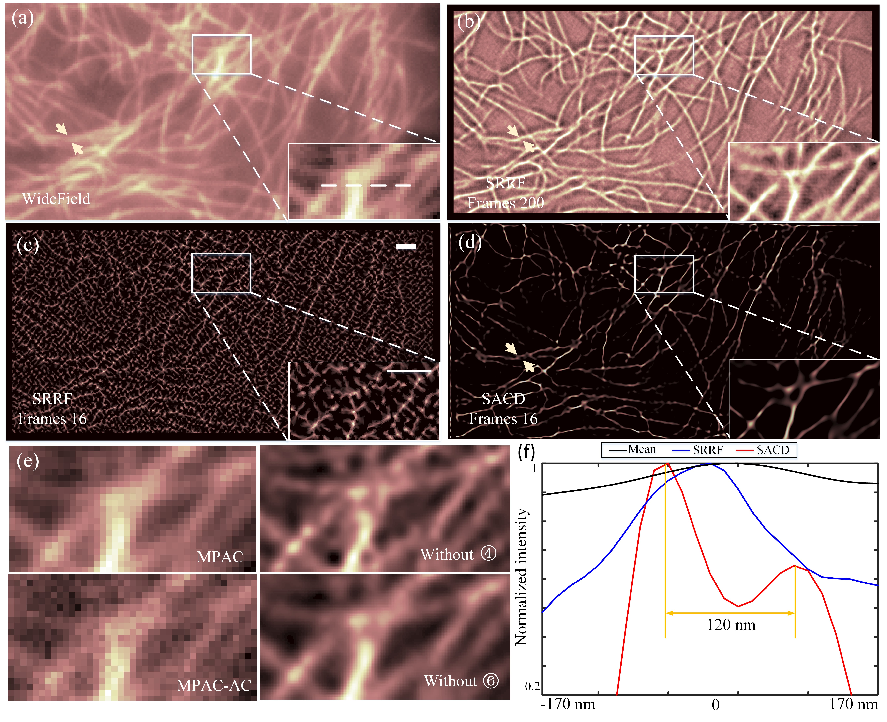

## SACD(**S**uper-resolution with **A**uto-**C**orrelation two-step **D**econvolution)

### Introduction
>This profile includding source code of the work: "**Temporal resolution enhancement in super-resolution imaging with auto-correlation two-step deconvolution**".<br />
>This program is free software: you can redistribute it and/or modify it under the terms of the **GNU** General Public License as published by the Free Software Foundation, either version 3 of the License, or (at your option) any later version. This program is distributed in the hope that it will be useful, but WITHOUT ANY WARRANTY; without even the implied warranty of MERCHANTABILITY or FITNESS FOR A PARTICULAR PURPOSE. See the GNU General Public License for more details.<br />
You are free to use this software package to analyse your fluctuation and all density of SMLM data, or generate your own algorithm. Please site the paper: coming soon...
### Denpendency
* >Matlab 7.0

### Some results:
#### Fluctuation data 
<table >
  
  <div align=center><center></center>
  
</table>
##### Image description
`SACD result of fluctuation images and comparison between SACD and SRRF using live-cell imaging data.`<br />
```python
(a) Mean wide-field image,
(b) SRRF reconstructed image with 200 frames, 
(c) SRRF reconstructed image with 16 frames SACD recons-tructed image, 
(d) SACD reconstructed image,
(e) Right: MPAC and error map between MPAC and AC image; left: SACD reconstructed image without first and second deconvolution step. (f) Normalized line profiles taken from the regions between the yellow arrowheads for corresponding images in (a), (b) and (d) showing separated features. 
Scale bar 1.5 μm. AC: auto-correlation.
```
#### High density SMLM data
<table >
  
  <div align=center><center></center>
  
</table>
##### Image description
`SACD result of high density SMLM images and comparison with the other super-resolution methods. `
```python
(a)-(b) The meaned wide-field image and the reconstructed images: 256 and 16 frames. 
(c) The magnified result of white boxed region. 
(d) Profiles of the projection through the dotted lines in (a). 
Scale bar (a) 2 μm; (c) 500 nm.
```


